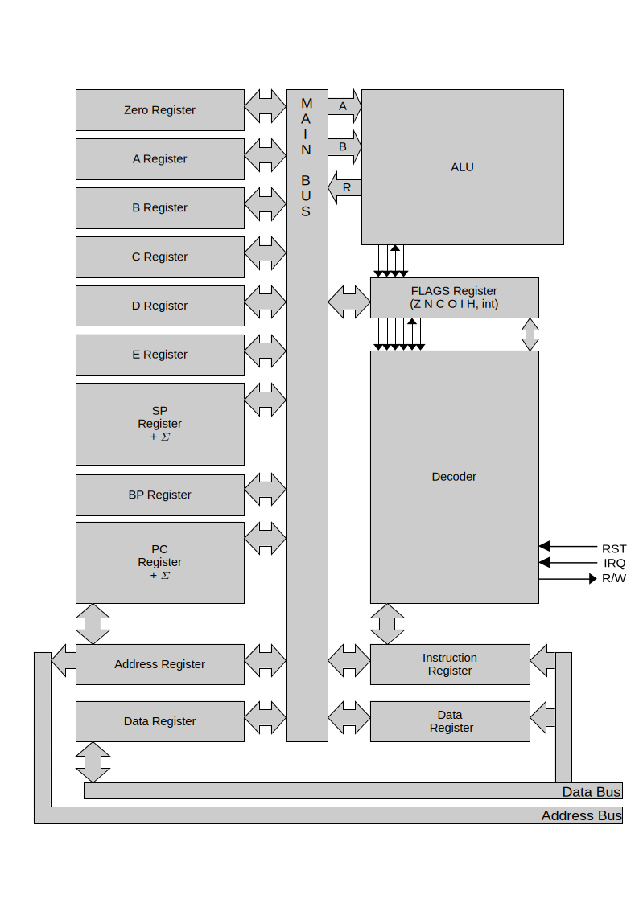

# Lumi's architecture 16

Lumi's architectue 16 (or LA-16) is a tiny RISC 16-bits CPU architecture.

## Block diagram:

Characteristics:

- Little endian
- 16-bit bytes and words
- 5 general-purpoise word-sized registers
- 16-bit instructions
- 32-bit extended instructions

For more informations about the architecture, see [architecture.md](./architecture.md)
